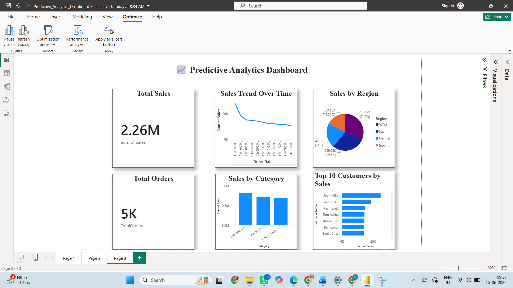

# 📈 Predictive Analytics Dashboard

## 📌 Project Overview

This project demonstrates Predictive Analytics using historical sales data in Power BI. The dashboard helps analyze sales trends, customer behavior, regional performance, and category-wise sales distribution. It provides valuable business insights that support data-driven decision-making and future trend analysis.

## 🎯 Objectives

- Analyze historical sales data
- Identify sales trends over time
- Understand customer purchasing behavior
- Compare sales across regions and categories
- Support predictive analytics and business forecasting

## 📊 Dashboard Features

### 1. Total Sales
Displays the overall sales generated from the dataset.

### 2. Total Orders
Shows the total number of customer orders.

### 3. Sales Trend Over Time
Visualizes historical sales performance and trend patterns.

### 4. Sales by Region
Analyzes sales contribution from different regions.

### 5. Sales by Category
Compares sales performance across product categories.

### 6. Top 10 Customers by Sales
Identifies the highest revenue-generating customers.

## 🛠️ Tools Used

- Power BI Desktop
- Microsoft Excel / CSV Dataset
- Data Visualization Techniques

## 📂 Files Included

- Predictive_Analytics_Dashboard.pbix
- Dataset (CSV File)
- Dashboard Screenshot
- README.md

## 📷 Dashboard Preview

## 📈 Key Insights

- Technology category generated the highest sales.
- West region contributed significantly to total revenue.
- A small group of customers generated a large portion of sales.
- Historical sales trends can be used to support future business planning.

## 🚀 Outcome

This project helped in understanding predictive analytics concepts, sales trend analysis, customer insights, and business intelligence reporting using Power BI.
